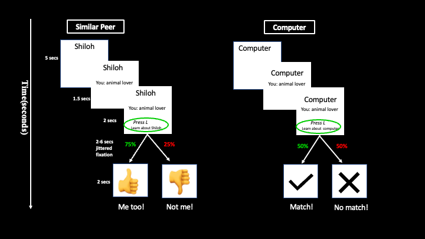

```{r, setup, include=FALSE}
proj_dir <- '/Users/hpopal/Google Drive/My Drive/dscn_lab/projects/scon_social_reward/'

knitr::opts_knit$set(root.dir = proj_dir)
```

# Background
The objective of this study was to examine how non-autistic and autistic process social rewards, and whether participants would be able to learn whether two individuals were more similar or dissimilar to them. Prior to the fMRI scan, participants completed a survey of their interests (e.g. I am an animal lover). Using this survey, with over 200 responses, we matched other real participants to each other, such that every participant had a similar peer which shared 75% of the same interests, and a dissimilar peer which shared only 25% of the same interests. In the fMRI task, participants were shown an individuals name, either Shiloh or Charlie. These were the similar or dissimilar peers. For each trial, participants were first shown the peer's name, then their own response to a survey question (e.g. animal lover indicating that the participant had responded that they love animals). Next, participants had to press a button to learn about the shown peer. The feedback consisted of a thumbs up with a "Me too!" message or a thumbs down with a "Not me!" message, indicating whether the peer had shared that interest or not. There was also a computer peer condition in which the computer gave 50% positive feedback as a "match" or "no match". 


## Task Design


This was an event-related design with four runs of the task. 


## Setup Up

### Import Packages
```{r, message=FALSE}
library(dplyr)
library(tidyr)
library(ggplot2)
library(emmeans)
library(lmerTest)
require(gridExtra)
library(multcomp)
library(plyr)
library(sjPlot)

```

### Define directories
```{r}
data_dir <- 'derivatives/task_socialreward/data/'
```

### Find participants
```{r}
subj_df <- read.csv('participants.tsv', sep = '\t')

# Remove prefix from subject IDs
subj_df$participant_id<-gsub("sub-SCN","SCN_",as.character(subj_df$participant_id))

print(paste('Found ', length(subj_df$participant_id), ' participants'))
```


# Data Cleaning
**Task errors:** The task programming had an error which would show the participant incorrect options for their own preferences (e.g. would show "like animals", when the participant said they didn't like animals). We will remove participants for which this occurred a lot (more than 5 trials). 
```{r}
# Create an empty dataframe to fill with all the participant data
rt_data <- data.frame(matrix(ncol = 6, nrow = 0))

# Name columns for the empty dataframe  
colnames(rt_data) <- c('ParticipantID', 'Run', 'X', 'rating', 'ConditionName', 
                       'Correct_RT')


# Import Data

for (subj in subj_df$participant_id) {
  
  # Find data for all runs
  run_files <- Sys.glob(paste(data_dir, subj, '/*-errors.csv', sep = ''))
  
  # Loop through runs and combine into one df
  for (run_file in run_files){
    temp_run_data <- read.csv(run_file)
    
    # Only include participant data if there were no task errors
    if (sum(temp_run_data$redcap_v_task) == 0) {
      
      # Filter for relevant columns
      temp_run_data_fltr <- temp_run_data[,colnames(rt_data)]
      
      # Append to entire df
      rt_data <- rbind(rt_data, temp_run_data_fltr)
    } 
  }
}

# Rename trial number column 
names(rt_data)[names(rt_data) == 'X'] <- 'trial_num'
```

Add group (e.g. autistic, non-autistic) info to reaction time dataframe
```{r}
rt_data <- merge(rt_data, subj_df, 
                 by.x = 'ParticipantID', by.y = 'participant_id')

# Rename column
rt_data <- rt_data %>% rename_at('ParticipantID', ~'participant_id')
```

Create column for the peer conditions info and valence of feedback
```{r}
rt_data <- rt_data %>% separate(ConditionName, c('Valence', 'Condition'))

rt_data$Valence <- gsub('LowReward','negative',as.character(rt_data$Valence))
rt_data$Valence <- gsub('HighReward','positive',as.character(rt_data$Valence))
```

Calculate the valence of the previous trial within each condition
```{r}
# Create an empty column of NAs
rt_data$Valence_prev <- NA

for (subj in unique(rt_data$participant_id)) {
  # Create a list of the runs for this participant
  temp_run_list <- unique(rt_data[rt_data$participant_id == 'SCN_101', 'Run'])
  
  for (run in temp_run_list) {
    
    for (cond in c('SimPeer', 'DisPeer', 'Computer')) {
      
      # Calculate the number of trials for a given condition per run per subject
      temp_len <- length(rt_data[rt_data$participant_id == subj & 
                                 rt_data$Run == run & 
                                 rt_data$Condition == cond, 'Valence'])
      
      # Create a list of the trial valences, excluding the first trial of that run
      # since nothing was shown before that trial in the run
      temp_val <- rt_data[rt_data$participant_id == subj & 
                          rt_data$Run == run & 
                          rt_data$Condition == cond, 'Valence'][1:temp_len-1]
      
      # Fill in the previous trial valence for that condition
      rt_data[rt_data$participant_id == subj & 
              rt_data$Run == run & 
              rt_data$Condition == cond, 'Valence_prev'] <- c(NA, temp_val)
    }
  }

}

```

Make group data an nominal data type
```{r}
rt_data$group <- gsub('1','non-autistic',as.character(rt_data$group))
rt_data$group <- gsub('2','autistic',as.character(rt_data$group))
head(rt_data)
```

## Demographic info
```{r}
demo_info <- read.csv('misc/SCONNChildPacket-IDs_DATA_2024-04-04_1620.csv')
demo_info <- demo_info[demo_info$redcap_event_name == 'time_1_arm_1', ]
demo_info$record_id <- toupper(demo_info$record_id)

demo_info <- demo_info[which((demo_info$record_id %in% unique(rt_data$participant_id))==TRUE),]

mean(as.numeric(demo_info$child_exact_age), na.rm=TRUE)
sd(as.numeric(demo_info$child_exact_age), na.rm=TRUE)
table(demo_info$child_gender_lab_entered)
```


## Missed trials
When a participant did not press the correct button, the feedback was "no data". This occurred in two instances:

- When the participant made no button press
- When the participant hit the incorrect button, and did not hit the correct button before the trial timed out

In both these instances, the participant was not paying attention and so we should exclude these trials. If this was the case for more than 20% of the run, then we should exclude data from the entire run.

```{r}
# Find participant runs with more than 20% missed trials

exclude_subj_runs <- data.frame(participant_id = character(), Run = character(), stringsAsFactors = FALSE)

# Create a list of all subject IDs
subj_list <- unique(rt_data$participant_id)

for (subj in subj_list) {
  
  # Filter for subject specific data
  temp_subj_data <- rt_data[rt_data$participant_id == subj, ]
  
  # Find runs per subject
  temp_runs <- unique(temp_subj_data$Run)
  
  for (run in temp_runs) {
    
    # Filter for run specific data
    temp_run_rt <- temp_subj_data[temp_subj_data$Run == run, 'Correct_RT']
    
    # Calculate the percentage of missed trials
    temp_na_perc <- sum(is.na(temp_run_rt)) / length(temp_run_rt)
    
    # If more than 20% missed trials, exclude the participant run
    if (temp_na_perc > 0.20) {
      exclude_subj_runs[nrow(exclude_subj_runs) + 1,] <- c(subj, run)
    }
  }
}

print(paste('Excluding',nrow(exclude_subj_runs),'runs from',
            length(unique(exclude_subj_runs$participant_id)),
            'participants'))

```

Use the list of bad participant runs to remove that data from the larger dataframe
```{r}
for (i in 1:nrow(exclude_subj_runs)) {
  temp_drop_idx <- which(rt_data$participant_id == exclude_subj_runs[i, "participant_id"] & 
                         rt_data$Run == exclude_subj_runs[i, "Run"])
  
  rt_data <- rt_data[-temp_drop_idx, ]
}

```

With the remaining data, create column for missing trials. This might be interesting as it could be an indicator of learning. For example, if participants have learned who the dissimilar peer is, perhaps they would respond less for those trials than the similar peer trials. Accurate button presses will be coded as 1, and inaccurate will be coded as 0.
```{r}
rt_data$accuracy <- 1
rt_data[is.na(rt_data$Correct_RT),'accuracy'] <- 0

table(rt_data$accuracy)
```

Add run as a categorical variable (don't end up using)
```{r}
rt_data$Run.f <- factor(rt_data$Run)
```


## Transforming Data

Using method from [Jones et al., 2014](https://pubmed.ncbi.nlm.nih.gov/24550063/):
"Reaction times to the cue after the wink occurred were z-score transformed to each individual’s mean and standard deviation after first removing outliers (defined as reaction times 3 standard deviations above or below the individual’s mean reaction time) and log transforming each reaction time to satisfy normality assumptions."

```{r}
# Create copy of the data
rt_data_mod <- data.frame(rt_data)

# Remove outliers greater than 3SD
#rt_data_mod[( rt_data_mod$ParticipantID %in% "SCN_101" & rt_data_mod$Correct_RT > 3*temp_sd),]

# Log transform
rt_data_mod$Correct_RT_log <- log(rt_data$Correct_RT)

# Create empty column for log zscored data
rt_data_mod$Correct_RT_logz <- NA

for (subj in subj_df$participant_id) {
# Calculate mean and SD
  temp_subj_data <- filter(rt_data_mod, participant_id == subj)
  temp_mean <- mean(temp_subj_data$Correct_RT_log, na.rm = TRUE)
  temp_sd <- sd(temp_subj_data$Correct_RT_log, na.rm = TRUE)
  rt_data_mod[(rt_data_mod$participant_id %in% subj),'Correct_RT_logz'] <- (rt_data_mod[(rt_data_mod$participant_id %in% subj),'Correct_RT_log'] - temp_mean)/temp_sd
}

```

```{r, warning=FALSE}
plot1 <- ggplot(rt_data_mod, aes(x=Correct_RT)) + geom_histogram() + theme_classic()

plot2 <- ggplot(rt_data_mod, aes(x=Correct_RT_logz)) + geom_histogram() + theme_classic()

grid.arrange(plot1, plot2, ncol=2)

```

The raw reaction times are not normally distributed and right-skewed. This may be a result of the task design where participants were given a window to view the interest and the peer condition, then a separate window to respond. So all participants were forced to view the condition for the same amount of time. After our log and z-transform, we have a normal distribution for the reaction times. 

Lastly, we will set the similar peer condition as the reference group for the regression analyses
```{r}
rt_data_mod$Condition <- relevel(factor(rt_data_mod$Condition), ref = "SimPeer")
```


***
# Non-Autistic Adolescents

```{r}
rt_data_mod_typ <- filter(rt_data_mod, group == 'non-autistic')
print(paste("There are ",length(unique(rt_data_mod_typ$participant_id)), 
            " autistic participants"))
```

## Run and Reaction Time
Use a linear mixed-effects model to model both the fixed effects of our conditions of interest, and the random effects of the participants. An example of a random effect would be that some participants are just faster to respond in all conditions. 
```{r}
model_run_typ <- lmer(Correct_RT_logz ~ Run + (1 + Run | participant_id), 
                data = rt_data_mod_typ)
summary(model_run_typ)
```

This analysis shows that participants are getting faster at responding throughout the task (B = -0.09, p = .0002). 
```{r}
ggplot(data = rt_data_mod_typ, aes(x=Run, y=Correct_RT_logz, group=Run)) + 
  geom_boxplot(outlier.shape = NA) + 
  geom_jitter(color='black', alpha=0.05) + 
  theme_classic()
```

The box plots show this significant tread, and the individual response times for all participants. 


## Peer Category and Run Predicting Reaction Time
Next, we will examine whether there are differences in reaction time to our peer conditions throughout the task. Again, the conditions were were getting feedback from a similar peer (75% positive feedback), dissimilar peer (25% positive feedback), or a random computer (50% positive feedback).

```{r}
model_run_peer_typ <- lmer(Correct_RT_logz ~ Run*Condition + (1 + Run*Condition | participant_id),
                       data = rt_data_mod_typ)
summary(model_run_peer_typ)
```


Accounting for the peer condition, task run had a significant impact on reaction times (B = -0.11, p < .001), such that participants were getting faster as the task went on. There was no significant main effect of peer condition. There is a trend for an interaction in which participants had faster reaction times throughout the task for the similar peer condition, in comparison to the computer control condition (B = .05, p = 0.05).

```{r}
ggplot(data = rt_data_mod_typ, aes(x=factor(Run), y=Correct_RT_logz, fill=Condition)) + 
  geom_boxplot(outlier.shape = NA) + 
  geom_point(alpha=0.05, aes(fill=Condition),
             position = position_jitterdodge(dodge.width = 0.8)) +
  theme_classic()
```

```{r}
tab_model(model_run_peer_typ)
```


```{r}
plot_model(model_run_peer_typ, type="pred", terms=c("Run","Condition"), 
           pred.type="re", ci.lvl=NA) + 
  theme_classic()
```

```{r}
rt_data_mod_typ_means <- aggregate(Correct_RT_logz ~ participant_id * Run * Condition, rt_data_mod_typ, mean)

rt_data_mod_typ_means$Condition <- factor(rt_data_mod_typ_means$Condition, 
                                          levels=c('SimPeer', 'DisPeer', 'Computer'))

ggplot(data=rt_data_mod_typ_means, aes(x=factor(Run), y=Correct_RT_logz, 
                                       group=Condition, color=Condition)) + 
  geom_smooth(method='lm') + 
  geom_jitter(alpha=0.2) + 
  scale_color_manual(values=c('#1f77b4', '#ff7f0e', '#2ca02c'),
                     labels=c('Similar Peer', 'Dissimilar Peer', 'Computer')) + 
  theme_classic()

```


## Previous Feedback and Run Predicting Reaction Time
Another way we can look at reaction time is to examine if reaction times would be effected by the valence of the previous trial from the same condition. For example, when considering to learn about "Shiloh" in the current trial, if Shiloh had given negative feedback in their last trial, perhaps the participants would be less motivated to learn about Shiloh in the current trial. 
```{r}
model_run_prev_val_typ <- lmer(Correct_RT_logz ~ Run*Valence_prev + (1 + Run*Valence_prev | participant_id),
                       data = rt_data_mod_typ)
summary(model_run_prev_val_typ)
```

```{r}
ggplot(data = subset(rt_data_mod_typ, !is.na(Valence_prev)), aes(x=factor(Run), y=Correct_RT_logz, fill=Valence_prev)) + 
  geom_boxplot(outlier.shape = NA) + 
  geom_point(alpha=0.05, aes(fill=Valence_prev),
             position = position_jitterdodge(dodge.width = 0.8)) +
  theme_classic()
```

The valence of the previous within condition trial did not have an impact on reaction times. 


## Previous Feedback, Peer Condition, and Run Predicting Reaction Time
Since the previous analysis failed, maybe explicitly adding an interaction for the peer condition will have an impact on reaction times. For example, the valence of the trial might be more salient when it is a similar peer who previously gave you positive feedback or a dissimilar peer who previously gave you negative feedback. 

```{r}
model_run_prev_val_cond_typ <- lmer(Correct_RT_logz ~ Run*Condition*Valence_prev + (1 + Run*Condition*Valence_prev | participant_id),
                       data = rt_data_mod_typ)
summary(model_run_prev_val_cond_typ)
```

```{r}
ggplot(data = subset(rt_data_mod_typ, !is.na(Valence_prev)), aes(x=factor(Run), y=Correct_RT_logz, fill=Condition, alpha=Valence_prev)) + 
  geom_boxplot(outlier.shape = NA) + 
  theme_classic()
```

Makes no difference.


## Are participants learning?

### Reaction time difference between similar and dissimilar peers
In the later runs, is there a difference in reaction time between the similar and dissimilar peer conditions? How many participants show this learning effect?

```{r}
rt_means_subj_cond_run_typ <- ddply(rt_data_mod_typ, c('participant_id','Condition','Run'), 
                                summarise, 
                                mean=mean(Correct_RT, na.rm=TRUE))
```

Calculate the difference in RT for similar and dissimilar peer conditions at run 4
```{r}
r4_peer_diff_typ <- data.frame(matrix(ncol = 2, nrow = 0))

# Name columns for the empty dataframe  
colnames(r4_peer_diff_typ) <- c('ParticipantID', 'sim_dis_RT')

for (subj in unique(rt_means_subj_cond_run_typ$participant_id)) {
  temp_subj_data <- rt_means_subj_cond_run_typ[rt_means_subj_cond_run_typ$participant_id == subj, ]
  
  temp_last_run <- temp_subj_data$Run[length(unique(temp_subj_data$Run))]
  
  temp_run_data <- temp_subj_data[temp_subj_data$Run == temp_last_run, ]
  temp_diff <- temp_run_data[temp_run_data$Condition == 'SimPeer', 'mean'] - temp_run_data[temp_run_data$Condition == 'DisPeer', 'mean']
  
  r4_peer_diff_typ[nrow(r4_peer_diff_typ) + 1,] = c(subj,temp_diff)
}

r4_peer_diff_typ$sim_dis_RT <- as.numeric(r4_peer_diff_typ$sim_dis_RT) 

ggplot(r4_peer_diff_typ, aes(x=sim_dis_RT)) + geom_histogram() + theme_classic()

```

```{r}
prop_learn <- nrow(r4_peer_diff_typ[r4_peer_diff_typ$sim_dis_RT < 0, ]) / nrow(r4_peer_diff_typ)

print(paste(round(prop_learn, 4)*100, '% of participants had faster RTs for similar peers than dissimilar peers for their last run.'))
```

```{r}
t.test(r4_peer_diff_typ$sim_dis_RT, alternative = "two.sided", var.equal = FALSE)
```


### Do participants show a decrease in RT after receiving positive feedback compared to negative feedback?
Note that previous valence here is the previous valence of the trial within the same condition. 
```{r}
rt_means_subj_pval_run_typ <- ddply(rt_data_mod_typ, c('participant_id','Valence_prev','Run'), 
                                summarise, 
                                mean=mean(Correct_RT, na.rm=TRUE))

# Remove rows with NA
rt_means_subj_pval_run_typ <- rt_means_subj_pval_run_typ[complete.cases(rt_means_subj_pval_run_typ), ]
```

Calculate the difference in RT for similar and dissimilar peer conditions at run 4
```{r}
# Create a new column for for previous valence
r4_peer_diff_typ$pos_neg_RT <- NA

for (subj in unique(rt_means_subj_pval_run_typ$participant_id)) {
  temp_subj_data <- rt_means_subj_pval_run_typ[rt_means_subj_pval_run_typ$participant_id == subj, ]
  
  temp_last_run <- temp_subj_data$Run[length(unique(temp_subj_data$Run))]
  
  temp_run_data <- temp_subj_data[temp_subj_data$Run == temp_last_run, ]
  temp_diff <- temp_run_data[temp_run_data$Valence_prev == 'positive', 'mean'] - temp_run_data[temp_run_data$Valence_prev == 'negative', 'mean']
  
  r4_peer_diff_typ[r4_peer_diff_typ$ParticipantID == subj, 'pos_neg_RT'] = temp_diff
}

r4_peer_diff_typ$pos_neg_RT <- as.numeric(r4_peer_diff_typ$pos_neg_RT) 

ggplot(r4_peer_diff_typ, aes(x=pos_neg_RT)) + geom_histogram() + theme_classic()

```

```{r}
prop_learn <- nrow(r4_peer_diff_typ[r4_peer_diff_typ$pos_neg_RT < 0, ]) / nrow(r4_peer_diff_typ)

print(paste(round(prop_learn, 4)*100, '% of participants had faster RTs for trials that were precided by a positive outcome than negative outcomes, for their last run.'))
```


```{r}
t.test(r4_peer_diff_typ$pos_neg_RT, alternative = "two.sided", var.equal = FALSE)
```


***
# All Participants

## Run and Reaction Time
Use a linear mixed-effects model to model both the fixed effects of our conditions of interest, and the random effects of the participants. An example of a random effect would be that some participants are just faster to respond in all conditions. 
```{r}
model_run <- lmer(Correct_RT_logz ~ Run + (1 + Run | participant_id), 
                data = rt_data_mod)
summary(model_run)
```

This analysis shows that participants are getting faster at responding throughout the task (B = -0.09, p = .0002). 
```{r}
ggplot(data = rt_data_mod, aes(x=Run, y=Correct_RT_logz, group=Run)) + 
  geom_boxplot(outlier.shape = NA) + 
  geom_jitter(color='black', alpha=0.05) + 
  theme_classic()
```

The box plots show this significant tread, and the individual response times for all participants. 


## Peer Category and Run Predicting Reaction Time
Next, we will examine whether there are differences in reaction time to our peer conditions throughout the task. Again, the conditions were were getting feedback from a similar peer (75% positive feedback), dissimilar peer (25% positive feedback), or a random computer (50% positive feedback).

```{r}
model_run_peer <- lmer(Correct_RT_logz ~ Run*Condition + (1 + Run*Condition | participant_id),
                       data = rt_data_mod)
summary(model_run_peer)
```


Accounting for the peer condition, task run had a significant impact on reaction times (B = -0.11, p < .001), such that participants were getting faster as the task went on. There was no significant main effect of peer condition. There is a trend for an interaction in which participants had faster reaction times throughout the task for the similar peer condition, in comparison to the computer control condition (B = .05, p = 0.05).

```{r}
ggplot(data = rt_data_mod, aes(x=factor(Run), y=Correct_RT_logz, fill=Condition)) + 
  geom_boxplot(outlier.shape = NA) + 
  geom_point(alpha=0.05, aes(fill=Condition),
             position = position_jitterdodge(dodge.width = 0.8)) +
  theme_classic()
```


## Previous Feedback and Run Predicting Reaction Time
Another way we can look at reaction time is to examine if reaction times would be effected by the valence of the previous trial from the same condition. For example, when considering to learn about "Shiloh" in the current trial, if Shiloh had given negative feedback in their last trial, perhaps the participants would be less motivated to learn about Shiloh in the current trial. 
```{r}
model_run_prev_val <- lmer(Correct_RT_logz ~ Run*Valence_prev + (1 + Run*Valence_prev | participant_id),
                       data = rt_data_mod)
summary(model_run_prev_val)
```

```{r}
ggplot(data = subset(rt_data_mod, !is.na(Valence_prev)), aes(x=factor(Run), y=Correct_RT_logz, fill=Valence_prev)) + 
  geom_boxplot(outlier.shape = NA) + 
  geom_point(alpha=0.05, aes(fill=Valence_prev),
             position = position_jitterdodge(dodge.width = 0.8)) +
  theme_classic()
```

The valence of the previous within condition trial did not have an impact on reaction times. 


## Previous Feedback, Peer Condition, and Run Predicting Reaction Time
Since the previous analysis failed, maybe explicitly adding an interaction for the peer condition will have an impact on reaction times. For example, the valence of the trial might be more salient when it is a similar peer who previously gave you positive feedback or a dissimilar peer who previously gave you negative feedback. 

```{r}
model_run_prev_val_cond <- lmer(Correct_RT_logz ~ Run*Condition*Valence_prev + (1 + Run*Condition*Valence_prev | participant_id),
                       data = rt_data_mod)
summary(model_run_prev_val_cond)
```

```{r}
ggplot(data = subset(rt_data_mod, !is.na(Valence_prev)), aes(x=factor(Run), y=Correct_RT_logz, fill=Condition, alpha=Valence_prev)) + 
  geom_boxplot(outlier.shape = NA) + 
  theme_classic()
```

Makes no difference.


## Are participants learning?

### Reaction time difference between similar and dissimilar peers
In the later runs, is there a difference in reaction time between the similar and dissimilar peer conditions? How many participants show this learning effect?

```{r}
rt_means_subj_cond_run <- ddply(rt_data_mod,c('participant_id','Condition','Run'), 
                                summarise, 
                                mean=mean(Correct_RT, na.rm=TRUE))
```

Calculate the difference in RT for similar and dissimilar peer conditions at run 4
```{r}
r4_peer_diff <- data.frame(matrix(ncol = 2, nrow = 0))

# Name columns for the empty dataframe  
colnames(r4_peer_diff) <- c('ParticipantID', 'sim_dis_RT')

for (subj in unique(rt_means_subj_cond_run$participant_id)) {
  temp_subj_data <- rt_means_subj_cond_run[rt_means_subj_cond_run$participant_id == subj, ]
  
  temp_last_run <- temp_subj_data$Run[length(unique(temp_subj_data$Run))]
  
  temp_run_data <- temp_subj_data[temp_subj_data$Run == temp_last_run, ]
  temp_diff <- temp_run_data[temp_run_data$Condition == 'SimPeer', 'mean'] - temp_run_data[temp_run_data$Condition == 'DisPeer', 'mean']
  
  r4_peer_diff[nrow(r4_peer_diff) + 1,] = c(subj,temp_diff)
}

r4_peer_diff$sim_dis_RT <- as.numeric(r4_peer_diff$sim_dis_RT) 

ggplot(r4_peer_diff, aes(x=sim_dis_RT)) + geom_histogram() + theme_classic()

```

```{r}
prop_learn <- nrow(r4_peer_diff[r4_peer_diff$sim_dis_RT < 0, ]) / nrow(r4_peer_diff)

print(paste(round(prop_learn, 4)*100, '% of participants had faster RTs for similar peers than dissimilar peers for their last run.'))
```

```{r}
t.test(r4_peer_diff$sim_dis_RT, alternative = "two.sided", var.equal = FALSE)
```


### Do participants show a decrease in RT after receiving positive feedback compared to negative feedback?
Note that previous valence here is the previous valence of the trial within the same condition. 
```{r}
rt_means_subj_pval_run <- ddply(rt_data_mod,c('participant_id','Valence_prev','Run'), 
                                summarise, 
                                mean=mean(Correct_RT, na.rm=TRUE))

# Remove rows with NA
rt_means_subj_pval_run <- rt_means_subj_pval_run[complete.cases(rt_means_subj_pval_run), ]
```

Calculate the difference in RT for similar and dissimilar peer conditions at run 4
```{r}
# Create a new column for for previous valence
r4_peer_diff$pos_neg_RT <- NA

for (subj in unique(rt_means_subj_pval_run$participant_id)) {
  temp_subj_data <- rt_means_subj_pval_run[rt_means_subj_pval_run$participant_id == subj, ]
  
  temp_last_run <- temp_subj_data$Run[length(unique(temp_subj_data$Run))]
  
  temp_run_data <- temp_subj_data[temp_subj_data$Run == temp_last_run, ]
  temp_diff <- temp_run_data[temp_run_data$Valence_prev == 'positive', 'mean'] - temp_run_data[temp_run_data$Valence_prev == 'negative', 'mean']
  
  r4_peer_diff[r4_peer_diff$ParticipantID == subj, 'pos_neg_RT'] = temp_diff
}

r4_peer_diff$pos_neg_RT <- as.numeric(r4_peer_diff$pos_neg_RT) 

ggplot(r4_peer_diff, aes(x=pos_neg_RT)) + geom_histogram() + theme_classic()

```

```{r}
prop_learn <- nrow(r4_peer_diff[r4_peer_diff$pos_neg_RT < 0, ]) / nrow(r4_peer_diff)

print(paste(round(prop_learn, 4)*100, '% of participants had faster RTs for trials that were precided by a positive outcome than negative outcomes, for their last run.'))
```


```{r}
t.test(r4_peer_diff$sim_dis_RT, alternative = "two.sided", var.equal = FALSE)
```


***
# Group Analyses
Next, we will analyze run by condition interactions for non-autistic adolescents and autistic adolescents, individually.


***
## Autistic
```{r}
rt_data_mod_asd <- filter(rt_data_mod, group == 'autistic')
print(paste("There are ",length(unique(rt_data_mod_asd$participant_id)), 
            " autistic participants"))
```

```{r}
model_run_peer_asd <- lmer(Correct_RT_logz ~ Run*Condition + (1 + Run | participant_id), data = rt_data_mod_asd)
summary(model_run_peer_asd)
```
In autistic adolescents, there are no significant main effects or interactions.

```{r}
m.lst <- emtrends(model_run_peer_asd, "Condition", var="Run")
pairs(m.lst)
```


```{r}
ggplot(data = rt_data_mod_asd, aes(x=factor(Run), y=Correct_RT_logz, 
                                   fill=Condition)) + 
  geom_boxplot(outlier.shape = NA) + 
  geom_point(alpha=0.05, aes(fill=Condition),
             position = position_jitterdodge(dodge.width = 0.8)) +
  theme_classic()
```


## Autistic vs Non-Autistic

In this analysis, we will examine specific contrasts between autistic and non-autistic adolescents. For example, we will test whether there are any group differences in reaction times for similar peers and the computer condition, throughout the task. 


