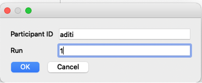
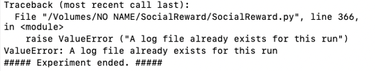

# Social Reward Task
Originally created by Oliver Xie in 2022

==========================================================================

# Task Information

## Conditions
- Peer
    - similar
    - dissimilar
    - computer
- Valence
    - positive
    - negative
- Feedback
    - agree
    - disagree
- Reward value
    - high
    - low

# Orienting
## Directories
### Flashdrive
- Stimuli_SocialReward
    - Redcap
        - Participant likes and dislikes survey data exported from Redcap
    - Answers
        - Contains spreadsheets of output of xxxx script which includes the items from the Redcap survey that will be in each condition category
- SocialReward_data
    - Output from the psychopy fMRI task file

# Setup
## Create the task input data
These series of steps will create a spreadsheet which will be inputted to the psychopy fMRI task, so that the correct survey answers will be presented in the correct conditions. 

**Before going to MNC:**
1. Download subject's answers from Redcap to the lab server in `redcay/Experiments/SCONN/Social Reward fMRI answers/wide_answers` and name the file as `SCN_[ID].csv` (e.g. `SCN_204.csv`)
2. Open the `widetolong.R` script in the `Social Reward fMRI answers` folder on the server and edit the `olddata_wide <- read.csv("SCN_222.csv")` line with the updated subject ID. Then run the script. This will output a file with the same name in the `Social Reward fMRI answers folder`
3. Copy the new long Redcap data to te lab USB drive in the folder of `/No Name/SocialReward/Stimuli_SocialReward/Redcap`, and save it as the same name (e.g. `SCN_104.csv`).
4. Open `/No Name/SocialReward/Stimuli_SocialReward/match_subj.R` file and update the participant ID. Run the script and if matching is successful, you will see a "matching successful" ouput. Then, the matched subjects are also output (e.g. "Similar peer is T2_118. Dissimilar peer is EMA_Pilot_048"). 
    - If the program outputs "matching failed", choose the other csv file as input (i.e. uncomment this line `incsv <- "TOTALsocialreward.csv" # if matching fails switch to this one`). 
    - Make sure the output is generated as the `/NO NAME/SocialReward/Stimuli_SocialReward/Answers/participant_ID.csv`
    - Optional: Updating `total_socrew_scn.csv`` with new participant, make sure there are no additional columns (i.e. columns in the end names "open1___1", "open2___2", etc.).

Wide to long script?

**At the MNC:**
5. Transfer the generated participant's behavioral file from the USB drive `/NO NAME/SocialReward/Stimuli_SocialReward/Answers/SCN_participantID.csv` to teh stim PC desktop at `Redcay/SCN/SocialReward/Answers/`. This is important!
6. Open `Desktop/Redcay/SCN/SocialReward/social_reward.py` in psychopy and input the participant ID and run number (1 - 4)
    
    - If an error was raised in the prompt, make sure oyu don't overwrite the existing log file.
        
    - If for some reason, you do need to overwrite the file (e.g. restart the scan), make sure to remove the corresponding log file in the `SocialReward_data` folder before starting. 
7. Save the output log `Redcay/SCN/SocialReward/SocialReward_data/SR_participant_ID_Run1-4.csv` to the USB drive in `SocialReward_data` file

For the practice run, open the `SocialReward_Practice.py` file in psychopy and input the participant ID. 

# Outputs
## Answers matching (e.g. SCN_219_answer.csv)
This csv file is the input for the psychopy task. The headers for this file refer to the task conditions. The "data" in this file refers to the Redcap survey item numbers. The psychopy task will include the survey items in the appropriate task conditions. For example, when the task presents a "like", this will be an item the participant was said to have liked, and then the feedback condition will present whether the other agent disagrees or agrees. 

### Header information
- agree_pos_sim = similar peer agrees with a like
- agree_neg_sim = similar peer agrees with a dislike
- disagree_pos_sim = similar peer disagrees with a like
- disagree_neg_sim = similar peer disagrees with a dislike
- agree_pos_dis = dissimilar peer agrees with a like
- agree_neg_dis = dissimilar peer agrees with a dislike
- disagree_pos_dis = dissimilar peer disagrees with a like 
- disagree_neg_dis = dissimilar peer disagrees with a dislike
- agree_pos_comp = computer agrees with a like
- agree_neg_comp = computer agrees with a dislike
- disagree_pos_comp = computer disagrees with a like
- disagree_neg_comp = computer disagrees with a dislike
- pos_practice = like practice
- neg_practice = dislike practice

